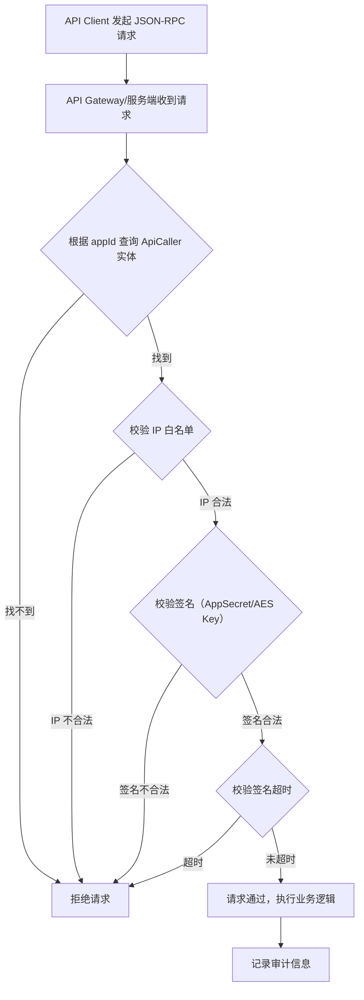

# JSON-RPC Caller Bundle 工作流程

```mermaid
flowchart TD
    A[API Client 发起 JSON-RPC 请求] --> B[API Gateway/服务端收到请求]
    B --> C{根据 appId 查询 ApiCaller 实体}
    C -- 找不到 --> D[拒绝请求]
    C -- 找到 --> E{校验 IP 白名单}
    E -- IP 不合法 --> D
    E -- IP 合法 --> F{校验签名（AppSecret/AES Key）}
    F -- 签名不合法 --> D
    F -- 签名合法 --> G{校验签名超时}
    G -- 超时 --> D
    G -- 未超时 --> H[请求通过，执行业务逻辑]
    H --> I[记录审计信息]
```

---

## 说明

- 每个 API 调用方通过唯一 appId 标识。
- 服务端根据 appId 查询 ApiCaller 实体，进行 IP、签名、超时等多重校验。
- 所有校验通过后才允许执行业务逻辑，并记录审计信息。
